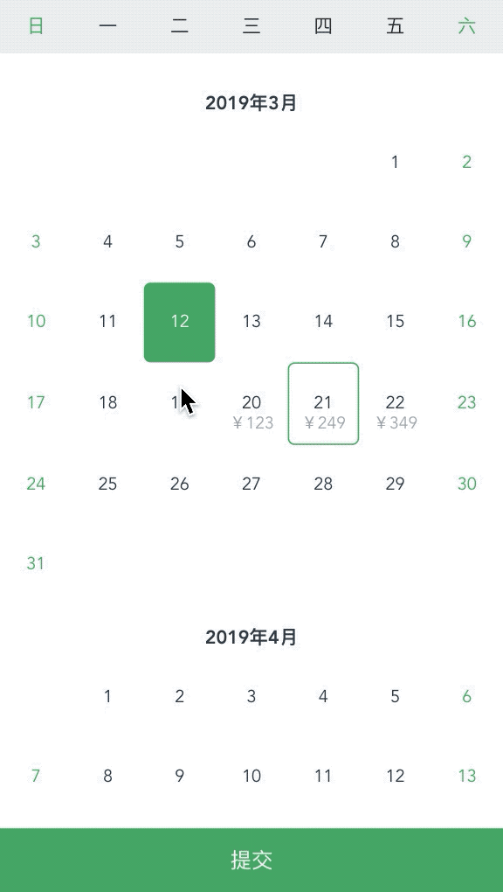
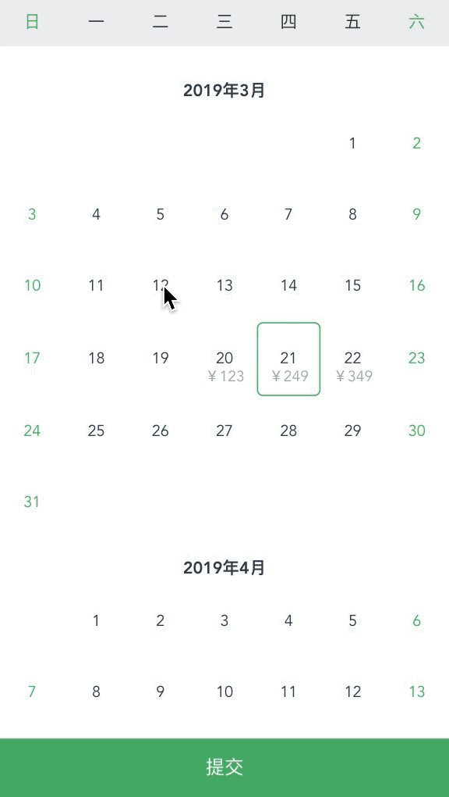
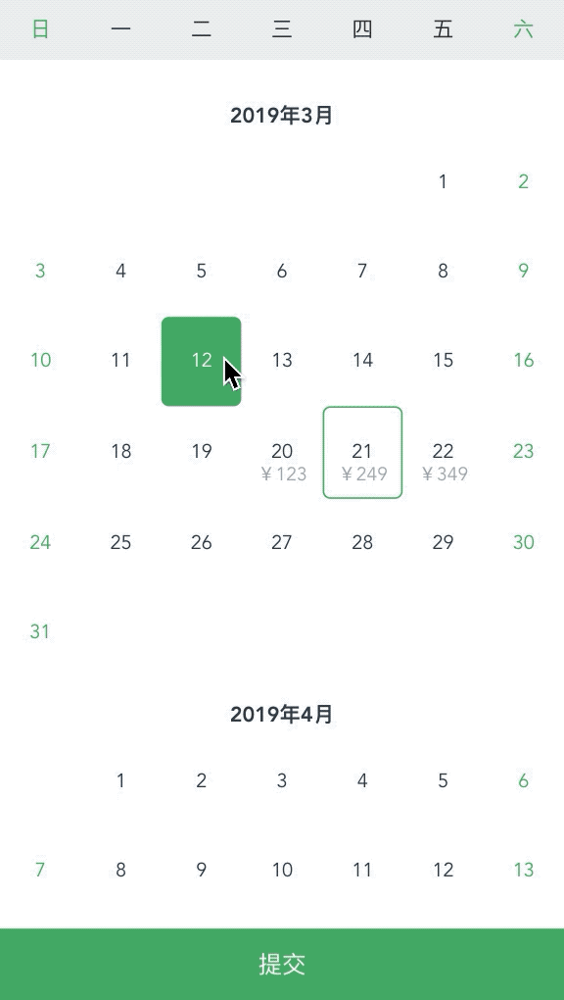

# vue-tour-calendar

------

针对旅游产品实现的Vue日历组件，主要是为了在日历上显示价格，以及用户选择相应的出行日期。UI原型参考的是同城旅游小程序的酒店预定日历选择，以及旅游产品选择出行日时的日历选择。

------

# 插件使用

## Usage

基础可配置参数options

| 参数名     | 取值        | 备注                                                         |
| ---------- | ----------- | ------------------------------------------------------------ |
| selectType | 0,1,2     | 0:单选，1:连续多选，2:任意多选                               |
| cleanMode  | true,false | true只显示当月数据，false会在当月数据中补齐上月末和下月初的数据 |

render-data用于用户数据绑定，初始化价格信息；数据结构如下，其中date和price必须，其他参数任意，选择后会传给回调函数

```javascript
[{
  date: '2019/03/20',
  price: '123',
  id: 1,
  ……
},{
  date: '2019/03/21',
  price: '249',
  id: 2,
  ……
},{
  date: '2019/03/22',
  price: '349',
  id: 3
},{
  date: '2019/04/21',
  price: '249',
  id: 4,
  ……
}]
```

calendar_confirm用户选择后点击提交按钮的回调事件绑定


- ### 单页面项目(Node环境)下使用

1. 安装组件依赖

   ```
   npm install vue-tour-calendar
   ```

   

2. 使用

   ```javascript
   <Calendar :options="option" :render-data="renderData" @calendar_confirm="confirm"></Calendar>
   
   <script>
   	import Calendar from 'vue-tour-calendar'
   	export default {
   		name: 'CalendarDemo',
   		components: {
   			Calendar
   		},
   		data() {
   			return {
   				option: {
   					selectType: 1
   				},
   				renderData: [{
   					date: '2019/03/20',
   					price: '123',
   					id: 1
   				}]
   			}
   		},
   		methods: {
   			confirm(data){
   				console.log(data)
   			}
   		}
   	}
   </script>
   ```

- ### 浏览器端执行

  1. 下载/dist/Calendar.umd.min.js

  2. 页面引用相关js

     ```html
     <meta charset="utf-8">
     <title>Calendar demo</title>
     <script src="https://unpkg.com/vue"></script>
     <script src="./Calendar.umd.js"></script>
     
     
     <div id="app">
       <demo></demo>
     </div>
     
     <script>
     new Vue({
       components: {
         demo: Calendar
       }
     }).$mount('#app')
     </script>
     
     ```

     

  

------

# 项目运行

## Project setup

```
npm install
```

### Compiles and hot-reloads for development

```
npm run serve
```

### Compiles and minifies for production

```
npm run build
```

### Run your tests

```
npm run test
```

### Lints and fixes files

```
npm run lint
```

### Customize configuration

See [Configuration Reference](https://cli.vuejs.org/config/).


------

效果预览图

该日历支持三种选择模式，通过配置相应选项，实现单选，连续多选，跨越多选。

1. 单选模式
   

2. 连续多选

   

3. 跨越多选

